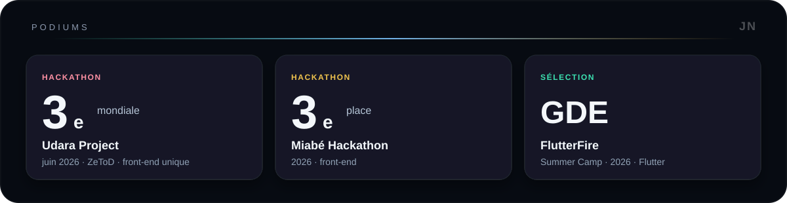
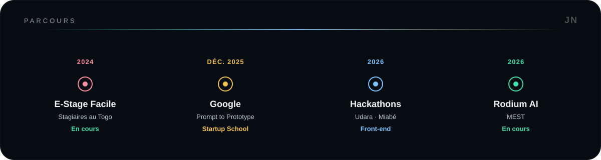
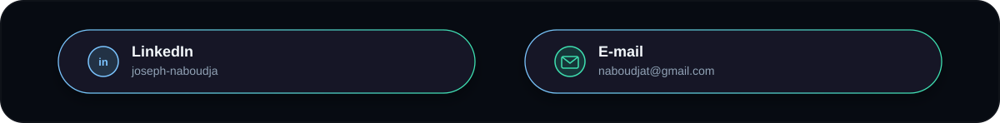

  

Développeur front-end et mobile à Lomé. Je construis des interfaces web et mobiles, et je monte vers le full-stack et les solutions d'IA.

  

  <picture>
    <source media="(prefers-color-scheme: dark)" srcset="https://raw.githubusercontent.com/Brayden-Code-4/Brayden-Code-4/output/github-contribution-grid-snake-dark.svg" />
    <source media="(prefers-color-scheme: light)" srcset="https://raw.githubusercontent.com/Brayden-Code-4/Brayden-Code-4/output/github-contribution-grid-snake.svg" />
    
  </picture>

  

  

Bénévole avec GDG Lomé, Space X AI Lomé et Forge4Africa.

  

  <a href="https://www.linkedin.com/in/joseph-naboudja-42193625b/">LinkedIn</a>
  &nbsp;&middot;&nbsp;
  <a href="mailto:naboudjat@gmail.com">naboudjat@gmail.com</a>

