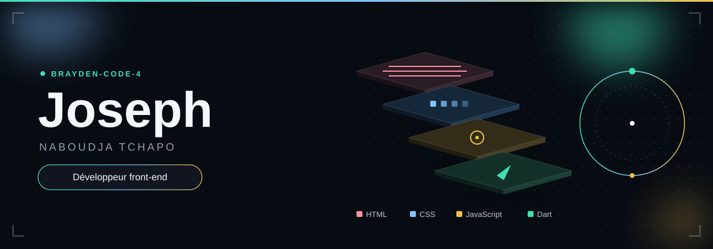
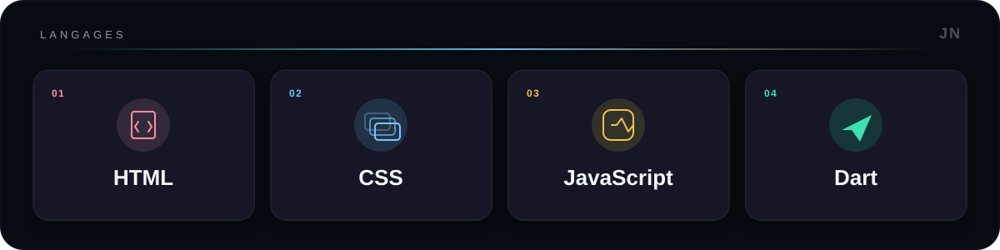

  

Développeur front-end et mobile à Lomé. Je construis des interfaces web et mobiles, et je monte vers le full-stack et les solutions d'IA.

  

  <picture>
    <source media="(prefers-color-scheme: dark)" srcset="https://raw.githubusercontent.com/Brayden-Code-4/Brayden-Code-4/output/github-contribution-grid-snake-dark.svg" />
    <source media="(prefers-color-scheme: light)" srcset="https://raw.githubusercontent.com/Brayden-Code-4/Brayden-Code-4/output/github-contribution-grid-snake.svg" />
    
  </picture>

### Repères

- **3e place mondiale** au hackathon The Udara Project (juin 2026), développeur front-end unique de l'équipe ZeToD.

- **3e place** au Miabé Hackathon (2026), côté front-end.

- **FlutterFire Summer Camp**, avec des Google Developer Experts (2026).

- **E-Stage Facile**, depuis 2024 : une plateforme pour le recrutement de stagiaires au Togo. Front-end, cahier des charges, et analyse de documents.

- **OTR** : stage développeur mobile d'octobre 2026 à octobre 2027, avec Flutter et Firebase.

Spécialisation RAG et agents IA en cours, avec Rhodium AI et le MEST Ghana. Bénévole avec GDG Lomé, Space X AI Lomé et Forge4Africa.

### Liens

- [GitHub](https://github.com/Brayden-Code-4)

- [LinkedIn](https://www.linkedin.com/in/joseph-naboudja-42193625b/)

- naboudjat@gmail.com

